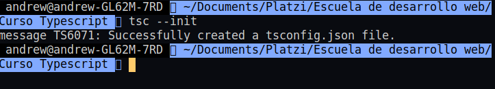

# Curso de TypeScript

## ¿Qué es TypeScript?

Es un Lenguaje de Programación de código abierto, basado en JavaScript. TypeScript contiene un superconjunto de métodos, funciones y otras características de JavaScript, tales como las clases, closures, entre otras.

TypeScript tiene soporte y una sintaxis similar de JavaScript, esto quiere decir que en el código de TypeScript se puede usar código JavaScript sin problemas.

Al estar creado sobre JavaScript, se puede considerar a TypeScript como un lenguaje de programación de alto nivel, cabe mencionar que dicha denominación es esencial de _JavaScript._ Asimismo,TypeScript también se le define como Superset, esta definición se le aplica a los Lenguajes de Programación que han sido escritos sobre otro Lenguaje de Programación.

Actualmente TypeScript es mantenido y soportado por una de las empresas más importantes del ámbito tecnológico, siendo esta  Microsoft.

## ¿Por qué TypeScript?

TypeScript mejora la experiencia y la productividad de los desarrolladores. Nos permite utilizar técnicas como el tipado estático opcional y/o la encapsulación para generar un código mucho más mantenible y escalable que con JavaScript tradicional.

## ¿Qué podemos hacer con TypeScript?

Gracias a que TypeScript está elaborado apartir de fases fijas y estructurales provenientes de JavaScript, nos permite interactuar, dinamizar y establecer procesos complementarios dentro del desarrollo de proyectos y tecnologías innovadoras, gracias al alcance y potencial de JavaScript, tales como:

* Aplicaciones Móviles \(Ionic, React Native, etc.\)
* Páginas Web
* Sistemas Webs
* Librerías que podemos alojarlas en el repositorio [NPM](https://www.npmjs.org/)
* Crear aplicaciones de lado del servidor en Node JS
* Crear aplicaciones Desktop en Electron JS
* Crear interfaces y funcionalidades en React JS
* Crear interfaces y funcionalidades en Vue JS
* Crear interfaces y funcionalidades en Angular
* Crear componentes y módulos.
* Consumir REST APIs
* Entre muchas otras cosas más.

Muchos proyectos que han sido creados con JavaScript pueden usar tranquilamente TypeScript y funcionar de maravilla.

## Instalación de herramientas

Para este curso vamos a necesitar tener instalado Node JS en nuestro computador y adicional a esto Visual Studio Code que será nuestro editor de código, este último se lleva de maravillas ya que fue desarrollado por Microsoft y gran parte de su desarrollo está realizado en TypeScript. Para tener más información de TypeScript en VS code puedes visitar el siguiene [link](https://code.visualstudio.com/docs/typescript/typescript-tutorial) .

Para instalar Node JS puedes dirigirte a su [página oficial ](https://nodejs.org/es/)-

### Typescript en Visual Studio Code

El editor Visual Studio Code viene configurado para aprovechar al máximo TypeScript.  
Entre las features se encuentran:

* IntelliSense
* Snippets
* JSDocs
* Formateo
* Refactorización
* Arreglos rápidos.

## El compilador de TypeScript

Es la herramienta estrella para trabajar con TypeScript. Sus siglas son tsc: _TypeScript Compiler_ . Esto nos permite compilar nuestro código _TypeScript_ a _JavaScript_ funcional en cualquier browser.

Para instalar TypeScript en nuestro equipo, ejecutamos el comando

```text
npm install -g typescript
```

> Nota:
>
> El -g indica que lo instalaremos de manera global para poder ejecutarlo en cualquiera de nuestros proyectos.

Ahora, procedemos a consultar la versión del compilador de TS

```text
tsc -v
```

### ¿Cómo usamos el compilador tsc?

Todos nuestros archivos de TypeScript tienen la extensión .TS, estos archivos serán la entrada para nuestro compilador tsc y su salida serán archivos .JS que serán utilizando en los distintos navegadores o en nuestros entornos de ejecución.

Supongamos que tenermos un archivo `Hello.ts`  , para compilador a .JS utilizamos el siguiente comando

```text
tsc Hello.ts
```

Como resultado de ejecutar el anterior comando, se generará un archivo con su mismo nombre pero con extensión .JS.

En este punto, es necesario un motor que pueda correr nuestro código JavaScript, en este caso puede ser el motor V8 \(desarrollado por Google\) que viene con Node JS. 

Ahora, pasaremos a realizar lo anterior pero en nuestro IDE.

```text
mkdir typescriptcourse
code .
```

Dentro de nuestro IDE, procedemos a crear el archivo `Hello.ts` 


Ahora, vamos a aprovechar que VS Code tiene una integración directa con la terminal y en ella ejecutaremos el siguiente comando

```text
tsc Hello.ts
```


Al ejecutar dicho comando, vemos que se genera nuestro archivo Hello.JS, el cuál vamos a ejecutar con el siguiente comando

```text
node Hello.js
```

> Nota:
>
> Los archivos TypeScript nunca se van a compilar directamente desde nuestros navegadores o desde Node JS. Por eso es importante usar el compilador de TypeScript

Al ejecutar dicho comando, obtenemos lo que esperabamos:


El compilador de TypeScript nos permite ejecutar una opción llamada watch, esta opción nos permite ejecutar un servicio que observará constantemente los cambios en nuestro archivo Typescript para compilarlos en su respectivo archivo JavaScript.

```text
tsc --watch Hello.ts
```

## El archivo de configuración de TypeScript

El archivo `tsconfig.json` permite especificar la raiz de un proyecto TypeScript, además de permitir configurar opciones del compilador tsc.

Para genera dicho archivo, ejecutamos el comando

```text
tsc --init
```

El resultado después de ejecutar dicho comando es el siguiente:



Como podemos observar, tenemos un "message" único para nuestro archivo de configuraciónd de TypeScript. El contenido de dicho archivo se ve como este

```javascript
{
    "compilerOptions": {
        /* Visit https://aka.ms/tsconfig.json to read more about this file */

        /* Basic Options */
        // "incremental": true,                   /* Enable incremental compilation */
        "target": "es5" /* Specify ECMAScript target version: 'ES3' (default), 'ES5', 'ES2015', 'ES2016', 'ES2017', 'ES2018', 'ES2019', 'ES2020', or 'ESNEXT'. */,
        "module": "commonjs" /* Specify module code generation: 'none', 'commonjs', 'amd', 'system', 'umd', 'es2015', 'es2020', or 'ESNext'. */,
        // "lib": [],                             /* Specify library files to be included in the compilation. */
        // "allowJs": true,                       /* Allow javascript files to be compiled. */
        // "checkJs": true,                       /* Report errors in .js files. */
        // "jsx": "preserve",                     /* Specify JSX code generation: 'preserve', 'react-native', or 'react'. */
        // "declaration": true,                   /* Generates corresponding '.d.ts' file. */
        // "declarationMap": true,                /* Generates a sourcemap for each corresponding '.d.ts' file. */
        // "sourceMap": true,                     /* Generates corresponding '.map' file. */
        // "outFile": "./",                       /* Concatenate and emit output to single file. */
        // "outDir": "./",                        /* Redirect output structure to the directory. */
        // "rootDir": "./",                       /* Specify the root directory of input files. Use to control the output directory structure with --outDir. */
        // "composite": true,                     /* Enable project compilation */
        // "tsBuildInfoFile": "./",               /* Specify file to store incremental compilation information */
        // "removeComments": true,                /* Do not emit comments to output. */
        // "noEmit": true,                        /* Do not emit outputs. */
        // "importHelpers": true,                 /* Import emit helpers from 'tslib'. */
        // "downlevelIteration": true,            /* Provide full support for iterables in 'for-of', spread, and destructuring when targeting 'ES5' or 'ES3'. */
        // "isolatedModules": true,               /* Transpile each file as a separate module (similar to 'ts.transpileModule'). */

        /* Strict Type-Checking Options */
        "strict": true /* Enable all strict type-checking options. */,
        // "noImplicitAny": true,                 /* Raise error on expressions and declarations with an implied 'any' type. */
        // "strictNullChecks": true,              /* Enable strict null checks. */
        // "strictFunctionTypes": true,           /* Enable strict checking of function types. */
        // "strictBindCallApply": true,           /* Enable strict 'bind', 'call', and 'apply' methods on functions. */
        // "strictPropertyInitialization": true,  /* Enable strict checking of property initialization in classes. */
        // "noImplicitThis": true,                /* Raise error on 'this' expressions with an implied 'any' type. */
        // "alwaysStrict": true,                  /* Parse in strict mode and emit "use strict" for each source file. */

        /* Additional Checks */
        // "noUnusedLocals": true,                /* Report errors on unused locals. */
        // "noUnusedParameters": true,            /* Report errors on unused parameters. */
        // "noImplicitReturns": true,             /* Report error when not all code paths in function return a value. */
        // "noFallthroughCasesInSwitch": true,    /* Report errors for fallthrough cases in switch statement. */

        /* Module Resolution Options */
        // "moduleResolution": "node",            /* Specify module resolution strategy: 'node' (Node.js) or 'classic' (TypeScript pre-1.6). */
        // "baseUrl": "./",                       /* Base directory to resolve non-absolute module names. */
        // "paths": {},                           /* A series of entries which re-map imports to lookup locations relative to the 'baseUrl'. */
        // "rootDirs": [],                        /* List of root folders whose combined content represents the structure of the project at runtime. */
        // "typeRoots": [],                       /* List of folders to include type definitions from. */
        // "types": [],                           /* Type declaration files to be included in compilation. */
        // "allowSyntheticDefaultImports": true,  /* Allow default imports from modules with no default export. This does not affect code emit, just typechecking. */
        "esModuleInterop": true /* Enables emit interoperability between CommonJS and ES Modules via creation of namespace objects for all imports. Implies 'allowSyntheticDefaultImports'. */,
        // "preserveSymlinks": true,              /* Do not resolve the real path of symlinks. */
        // "allowUmdGlobalAccess": true,          /* Allow accessing UMD globals from modules. */

        /* Source Map Options */
        // "sourceRoot": "",                      /* Specify the location where debugger should locate TypeScript files instead of source locations. */
        // "mapRoot": "",                         /* Specify the location where debugger should locate map files instead of generated locations. */
        // "inlineSourceMap": true,               /* Emit a single file with source maps instead of having a separate file. */
        // "inlineSources": true,                 /* Emit the source alongside the sourcemaps within a single file; requires '--inlineSourceMap' or '--sourceMap' to be set. */

        /* Experimental Options */
        // "experimentalDecorators": true,        /* Enables experimental support for ES7 decorators. */
        // "emitDecoratorMetadata": true,         /* Enables experimental support for emitting type metadata for decorators. */

        /* Advanced Options */
        "skipLibCheck": true /* Skip type checking of declaration files. */,
        "forceConsistentCasingInFileNames": true /* Disallow inconsistently-cased references to the same file. */
    }
}

```

Una vez creado y configurado nuestro archivo `tsconfig.json,` con la ayuda de tsc podemos definir diferentes usos para tsconfig


Ahora, procedemos a crear una carpeta denominada src \(sources\) en nuestro proyecto, movemos nuestro archivo Hello.ts a dicha carpeta y borramos Hello.js. Ahora, ejecutamos el comando tsc por si solo y este empieza a buscar la configuración, de modo que por si solo crea nuestro archivo Hello.js en el directorio src


## Mi primer proyecto TypeScript

En esta sección trabajaremos en nuestro primer proyecto con Typescript. 

Lo primero que haremos será dirigirnos a nuestro archivo `tsconfig.json`, en este buscaremos el parámetro outDir y vamos a personalizar la salida de los diferentes archivos JS para nuestro proyecto

```javascript
"outDir":"./dist",
```

Al guardar los cambios en nuestro .JSON, nos dirigimos a la terminar y ejecutamos

```javascript
tsc
```

Esto lo que hará es buscar la configuración de nuestro archivo .**JSON**, por lo que creará el directorio dist y dentro de este nuestro archivos compilados **.JS** 


El siguiente paso consiste en dirigirnos a nuestra terminal y acceder al directorio dist , y ejecutar node para comprobar que nuestro archivo **.JS** genera lo que esperabamos 


Muy bien, ahora crearemos un archivo `main.ts` con el cuál trabajaremos de aquí en adelante. En este agregaremos un código bastante simple:

```typescript
console.log('Hola Platzi')
```

Ahora, en nuestra terminal ejecutamos el comando 

```typescript
tsc --watch
```

De modo que compile automaticamente los cambios que hagamos en nuestro archivo `main.ts`

## Tipos en TypeScript

### Tipado en TypeScript

Ahora veremos cuáles son los tipos de datos que existen en TypeScript y las oportunidades que nos ofrecen:


En TypeScript se encuentran definidos ciertos tipos básicos, conocidos también como tipos primitivos con los cuáles es fundamental trabajar en nuestros desarrollos. Entre estos se encuentran:


### Number, Boolean and String


Ahora, veremos en código como podemos definir variables con este tipo de dato:

```typescript
//Number
//Explícito
let phone: number;
phone = 15;
phone = 2544;

//Inferido
let phoneNumber = 2547;
phoneNumber = 124;
// phoneNumber=true //Error por tipo

//Hexadecimal
let hex: number = 0xf00d;
//Binario
let binary: number = 0b1010;
//Octal
let octal: number = 0o744;
```


Veamos ahora en código como podemos defnir variables utilizando este tipo de dato:


